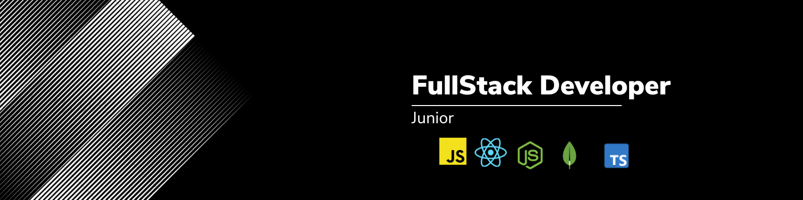

  <p align="center">
   
  </p>

  <p align="center">
  
  
  
</p>

<p align="center">
   
  </p>

  

# :clipboard: Sobre o projeto

Este é um projeto simples onde você poderá ver um pouco mais sobre mim e meus conhecimentos em desenvolvimento web.

Abaixo podemos ver o resultado final do projeto. Espero que gostem!

<br>
<p align="center">
   
  </p>

# 🔗 Acesse o site com o link abaixo.

- [To Do List | Lembrete do dia a dia](https://www.willtechcod.com/)

- [Vite](https://getbootstrap.com/)
- [React.Js](https://styled-components.com/)
- [HTML](https://developer.mozilla.org/pt-BR/docs/Web/HTML)
- [CSS](https://developer.mozilla.org/pt-BR/docs/Web/CSS)

## 🌐 Para iniciarlizar o projeto utilize o comando abaixo:

```bash

#Clonando o repositório do Github:
$ git clone https://github.com/willtechcod/site.portfolio.git

#Acessar pasta Web:
$ cd todo-list

#Instalar alguns packages:
$ npm i

#Inicializar pasta Web:
$ npm run dev

```


<p align="center">
  
  </p>
